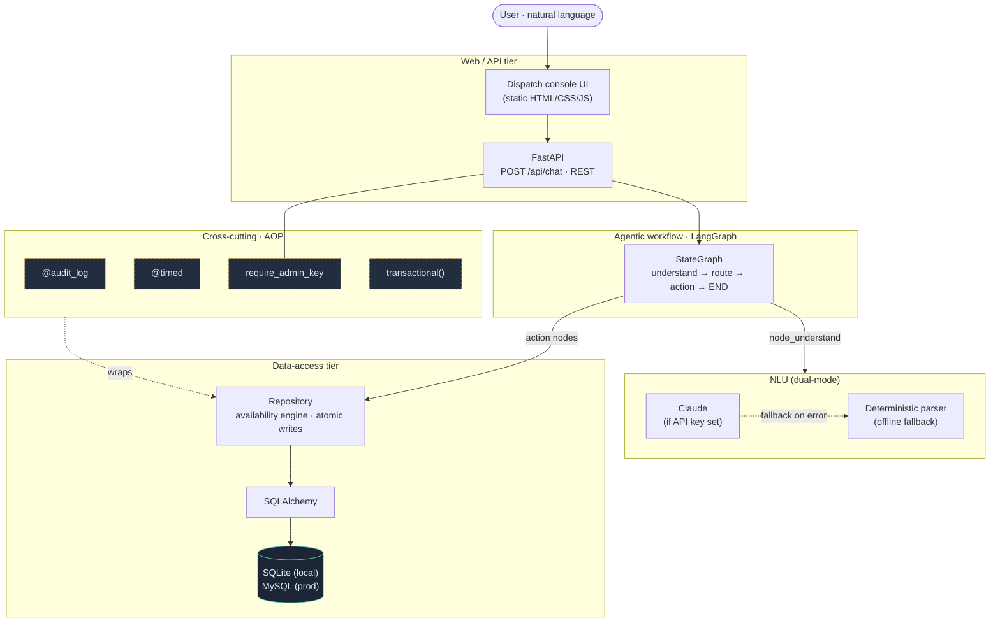
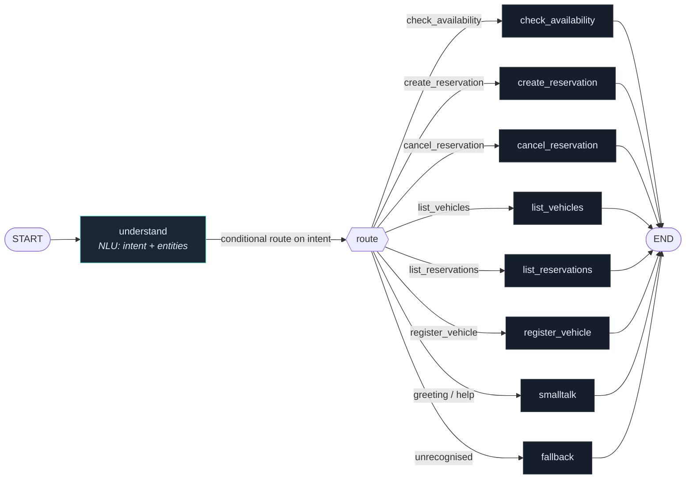
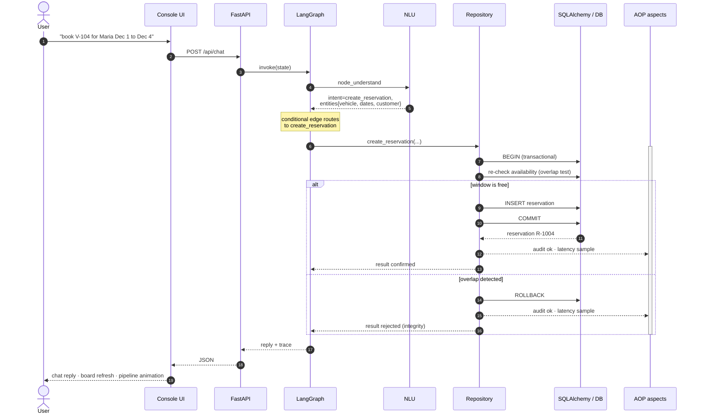

# RPS 2.0 — Architecture

Three views of the system: the **layered architecture**, the **LangGraph agent
topology**, and a **request sequence** for a booking. All diagrams are Mermaid
and render automatically on GitHub.

> Static exports (PNG + SVG) live in [`docs/diagrams/`](docs/diagrams) for use in
> slides, one-pagers, or anywhere Mermaid isn't rendered.

---

## 1. System architecture

How a request flows through the tiers, and where cross-cutting concerns apply.

**Reading it:** the agent is the orchestrator; the repository is the only thing
that touches the database; the AOP aspects wrap repository operations so logging,
timing, and security never leak into business logic. Swapping SQLite for MySQL or
rules for Claude changes a config value, not the topology.

---

## 2. LangGraph agent topology

The compiled `StateGraph` in `rps/agent/graph.py`. One entry node, a single
conditional edge that routes on the classified intent, and one node per
capability — all terminating at `END`.

**Why a graph:** adding a capability is one new node plus one route entry — the
control flow stays explicit and testable. State (`message`, `intent`,
`entities`, `result`, `reply`, `trace`) flows as partial updates that LangGraph
merges; the `trace` field uses an additive reducer, which is what drives the live
pipeline panel in the UI.

---

## 3. Booking request — sequence

What actually happens on `book V-104 for Maria Dec 1 to Dec 4`, including the
in-transaction re-check that guarantees no double-booking.

**The integrity guarantee:** the availability re-check happens *inside* the same
transaction immediately before insert, so even if two requests both pass the
initial check, only one commits. The overlap test uses half-open intervals
`[start, end)`, so back-to-back bookings are allowed but any true overlap is
refused.
